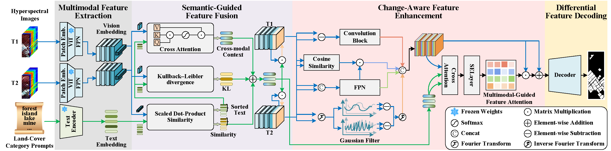

# PromptHSI-CD: A Land-Cover Category Prompt-Guided Method for Hyperspectral Change Detection

Official implementation of the paper **“PromptHSI-CD: A Land-Cover Category Prompt-Guided Method for Hyperspectral Change Detection.”**



## 1. Environment Setup

Create the conda environment using the provided configuration file:

```shell
conda env create -f environment.yml
```

## 2. Download Pretrained Weights and Datasets

Download the pretrained **ViT-B-16** weights from the [official CLIP link](https://openaipublic.azureedge.net/clip/models/5806e77cd80f8b59890b7e101eabd078d9fb84e6937f9e85e4ecb61988df416f/ViT-B-16.pt),
and place the file at:

```text
pretrained/ViT-B-16.pt
```

Only the Chinese farmland dataset is included in this repository.
For the other four datasets used in the paper, please download them from [Google Drive](https://drive.google.com/drive/folders/1rT4BMEwePcGgTvMX4PlqeGHj9jHcgXRN?usp=sharing)

## 3. Configuration

The experiment settings are defined in the YAML files under `configs/PromptHSICD`. Specifically, `base.yaml` is the base configuration, and the remaining files provide dataset-specific parameters.

## 4. Training

Run the following commands to train the model on different datasets:

```shell
python -m src.main -cfg configs/PromptHSICD/china.yaml -train
python -m src.main -cfg configs/PromptHSICD/usa.yaml -train
python -m src.main -cfg configs/PromptHSICD/river.yaml -train
python -m src.main -cfg configs/PromptHSICD/santa.yaml -train
python -m src.main -cfg configs/PromptHSICD/bay.yaml -train
```

## 5. Validation

Validation is automatically performed once after training, and the reported metrics are reliable.

You can also run validation separately using:

```shell
python -m src.main -cfg configs/PromptHSICD/china.yaml -val
python -m src.main -cfg configs/PromptHSICD/usa.yaml -val
python -m src.main -cfg configs/PromptHSICD/river.yaml -val
python -m src.main -cfg configs/PromptHSICD/santa.yaml -val
python -m src.main -cfg configs/PromptHSICD/bay.yaml -val
```

## 6. Testing

The test mode is intended only for visualization of the results.

Please note that the test metrics are **not reliable** and should **not** be used for quantitative evaluation.

```shell
python -m src.main -cfg configs/PromptHSICD/china.yaml -test
python -m src.main -cfg configs/PromptHSICD/usa.yaml -test
python -m src.main -cfg configs/PromptHSICD/river.yaml -test
python -m src.main -cfg configs/PromptHSICD/santa.yaml -test
python -m src.main -cfg configs/PromptHSICD/bay.yaml -test
```

## 7. Results

All outputs will be saved in `outputs/PromptHSICD_<dataset_name>`